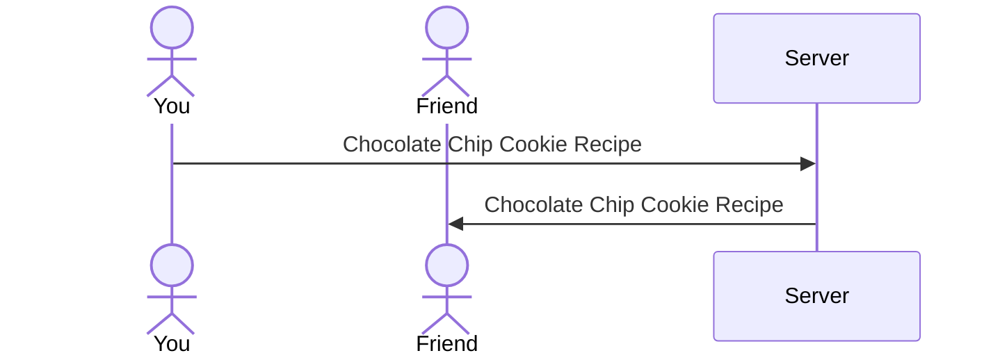

# Recipe Book

[My Notes](notes.md)

A compilation of favorite recipes that you can share with others. Gather your favorite recipes to make your very own recipe book! View others recipes and search the database.

> [!NOTE]
>  This is a template for your startup application. You must modify this `README.md` file for each phase of your development. You only need to fill in the section for each deliverable when that deliverable is submitted in Canvas. Without completing the section for a deliverable, the TA will not know what to look for when grading your submission. Feel free to add additional information to each deliverable description, but make sure you at least have the list of rubric items and a description of what you did for each item.

> [!NOTE]
>  If you are not familiar with Markdown then you should review the [documentation](https://docs.github.com/en/get-started/writing-on-github/getting-started-with-writing-and-formatting-on-github/basic-writing-and-formatting-syntax) before continuing.

## 🚀 Specification Deliverable

> [!NOTE]
>  Fill in this sections as the submission artifact for this deliverable. You can refer to this [example](https://github.com/webprogramming260/startup-example/blob/main/README.md) for inspiration.

For this deliverable I did the following. I checked the box `[x]` and added a description for things I completed.

- [x] Proper use of Markdown
- [x] A concise and compelling elevator pitch
- [x] Description of key features
- [x] Description of how you will use each technology
- [x] One or more rough sketches of your application. Images must be embedded in this file using Markdown image references.

### Elevator pitch

Everybody eats, I don't know anybody that doesn't. And everybody knows that homecooked meals are the best. That's why you can create your very own Recipe Book by digitalizing your favorite recipes! This makes it easy to share recipes with friends, so they too can enjoy! If you are looking for new recipes you can view popular recipes and search for other's favorites.

### Design

Here is a sequence diagram that shows how people would interact with the backend to upload recipes.

### Key features

- Secure login over HTTPS
- Ability to create, edit, and delete recipe cards
- Display of popular recipes
- Ability to search uploaded recipe cards

### Technologies

I am going to use the required technologies in the following ways.

- **HTML** - Uses correct HTML structure for application. Four HTML pages. The login page, home page, create recipe page, and the view recipe page. 
- **CSS** - Application styling that looks good on different screen sizes, uses good whitespace, color choice and contrast.
- **React** - Provides login, recipe display, display other users recipes, searching recipes, and use of React for routing and components.
- **Service** - Backend service with endpoints for:
    - login
    - retrieving recipes
    - submitting recipes
- **DB/Login** - Store users, and recipes in database. Register and login users. Credentials securely stored in database. Can't create unless authenticated.
- **WebSocket** - As each user creates a new recipe, it is broadcasted to all other users.

## 🚀 AWS deliverable

For this deliverable I did the following. I checked the box `[x]` and added a description for things I completed.

- [x] **Server deployed and accessible with custom domain name** - [Recipe Book](https://recipebook260.click).

## 🚀 HTML deliverable

For this deliverable I did the following. I checked the box `[x]` and added a description for things I completed.

- [x] **HTML pages** - I add 4 pages. index.html, home.html, createRecipe.html, and viewRecipe.html.
- [x] **Proper HTML element usage** - I correctly use a nav, header, main, and footer per page.
- [x] **Links** - I have links that go between all the pages.
- [x] **Text** - I added text for headers and placeholders.
- [x] **3rd party API placeholder** - I added a placeholder for it on the home.html page, id="nutrition".
- [x] **Images** - I added an image on the index.html. Everypage also has a recipe icon in the browser.
- [x] **Login placeholder** - the index.html page has a placeholder login that takes you to the home.html page.
- [x] **DB data placeholder** - The createRecipe.html page will store its information into the database and be accessed by the viewRecipe.html page. Currently they have placeholders.
- [x] **WebSocket placeholder** - The home.html page has a placeholder, Popular Recipes, to display other user's recipes.

## 🚀 CSS deliverable

For this deliverable I did the following. I checked the box `[x]` and added a description for things I completed.

- [x] **Header, footer, and main content body** - I used a css file and inline css for my header, footer, and main elements.
- [x] **Navigation elements** - Every page uses a navigation bar that has an active link status.
- [x] **Responsive to window resizing** - Each page shrinks responds to window resizing.
- [x] **Application elements** - The input boxes, p tags, titles, etc. that I used for my application elements have appropriate css.
- [x] **Application text content** - The text content has css.
- [x] **Application images** - I used css for my image to make it the size of the main tag.

## 🚀 React part 1: Routing deliverable

For this deliverable I did the following. I checked the box `[x]` and added a description for things I completed.

- [x] **Bundled using Vite** - I bundled my project using vite.
- [x] **Components** - I converted all of the html pages to their own component and imported the css files.
- [x] **Router** - I added routing between all of the pages

## 🚀 React part 2: Reactivity

For this deliverable I did the following. I checked the box `[x]` and added a description for things I completed.

- [x] **All functionality implemented or mocked out** - I fully implemented or mocked all features.
- [x] **Hooks** - I used hooks in all of my pages.

## 🚀 Service deliverable

For this deliverable I did the following. I checked the box `[x]` and added a description for things I completed.

- [ ] **Node.js/Express HTTP service** - I did not complete this part of the deliverable.
- [ ] **Static middleware for frontend** - I did not complete this part of the deliverable.
- [ ] **Calls to third party endpoints** - I did not complete this part of the deliverable.
- [ ] **Backend service endpoints** - I did not complete this part of the deliverable.
- [ ] **Frontend calls service endpoints** - I did not complete this part of the deliverable.

## 🚀 DB/Login deliverable

For this deliverable I did the following. I checked the box `[x]` and added a description for things I completed.

- [ ] **User registration** - I did not complete this part of the deliverable.
- [ ] **User login and logout** - I did not complete this part of the deliverable.
- [ ] **Stores data in MongoDB** - I did not complete this part of the deliverable.
- [ ] **Stores credentials in MongoDB** - I did not complete this part of the deliverable.
- [ ] **Restricts functionality based on authentication** - I did not complete this part of the deliverable.

## 🚀 WebSocket deliverable

For this deliverable I did the following. I checked the box `[x]` and added a description for things I completed.

- [ ] **Backend listens for WebSocket connection** - I did not complete this part of the deliverable.
- [ ] **Frontend makes WebSocket connection** - I did not complete this part of the deliverable.
- [ ] **Data sent over WebSocket connection** - I did not complete this part of the deliverable.
- [ ] **WebSocket data displayed** - I did not complete this part of the deliverable.
- [ ] **Application is fully functional** - I did not complete this part of the deliverable.
